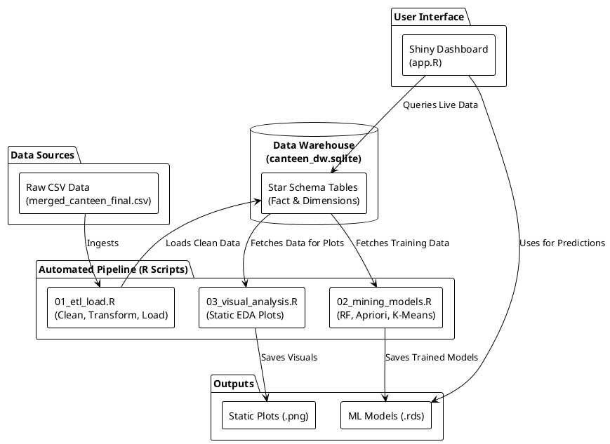

# System Architecture Diagram

This PlantUML diagram illustrates the high-level architecture of the Smart Canteen Analytics system, showing how data flows from the source CSV through the ETL process into the data warehouse, gets processed by R scripts to generate models/visuals, and finally surfaces on the Shiny dashboard.

