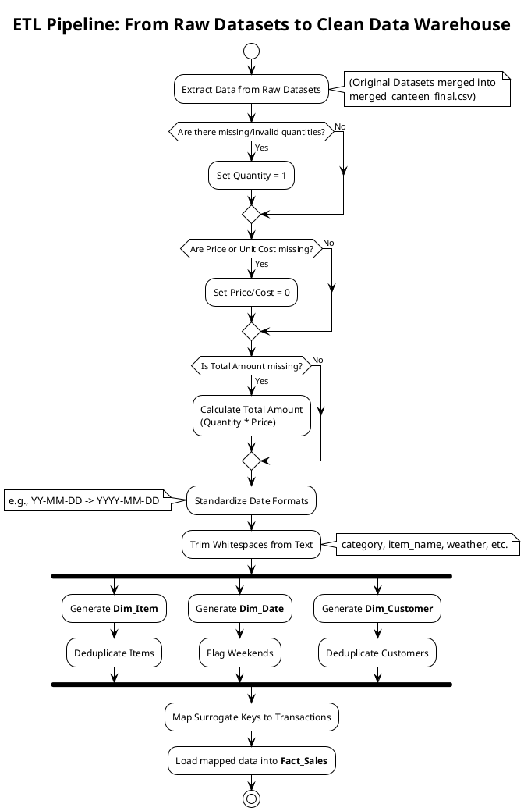

# Data Cleaning & Transformation Process

This document explains what data was originally missing or messy from the raw datasets and outlines the exact ETL (Extract, Transform, Load) processes applied to make it usable for the Data Warehouse.

## 1. What Was Missing or Messy in the Raw Data?

Based on the ETL pipeline logic (`01_etl_load.R`), the raw merged dataset (`merged_canteen_final.csv`) had the following issues that made it unusable out of the box:

1. **Missing or Invalid Quantities:** Some transactions lacked quantity data or had negative quantities (`NA` or `<= 0`).
2. **Missing Prices & Costs:** `price` and `unit_cost` fields had null values (`NA`).
3. **Missing Total Amounts:** The `total_amount` field was missing for certain rows.
4. **Inconsistent Date Formats:** Dates were recorded in mixed formats across the datasets (e.g., `YYYY-MM-DD`, `DD-MM-YY`, `MM/DD/YYYY`).
5. **Messy Text Fields:** Categorical text fields (`category`, `item_name`, `customer_type`, `weather`) contained irregular trailing or leading whitespaces which would corrupt grouping and aggregations.
6. **Duplicate Dimensions:** Repeated items had slight variations in price or strings.

## 2. Process Applied to Make it Usable

The system runs an automated R script pipeline to clean and structure the data:

1. **Imputation:** 
   - Replaced missing or `<=0` `quantity` with a default of `1`.
   - Replaced missing `price` and `unit_cost` with `0`.
   - Calculated missing `total_amount` dynamically dynamically as `quantity * price`.
2. **Date Standardization:** Used `lubridate` to uniformly parse all mixed date formats into a standard `Date` object string.
3. **String Trimming:** Applied `trimws()` to all text vectors to ensure clean category aggregations.
4. **Dimensional Modeling:** Broke down the flat CSV into distinct `Dim_Item`, `Dim_Date`, and `Dim_Customer` tables. Deduplicated `Dim_Item` to ensure one single primary key per item name.
5. **Key Mapping:** Re-joined the clean transactional rows back to the auto-generated surrogate keys to create a pristine `Fact_Sales` table.

---

## 3. Data Processing UML Plant Diagram

Below is a PlantUML activity/process diagram visually representing the exact flow from the raw datasets to the final structured schema.

