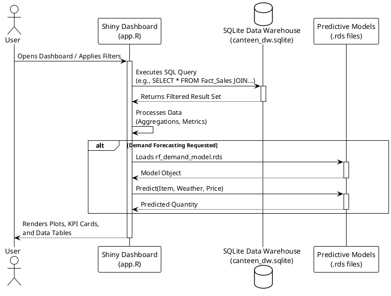

# Data Retrieval Flow Diagram

This PlantUML sequence diagram explains how the Shiny Dashboard retrieves and processes data from the SQLite Data Warehouse and the Machine Learning models during runtime.

