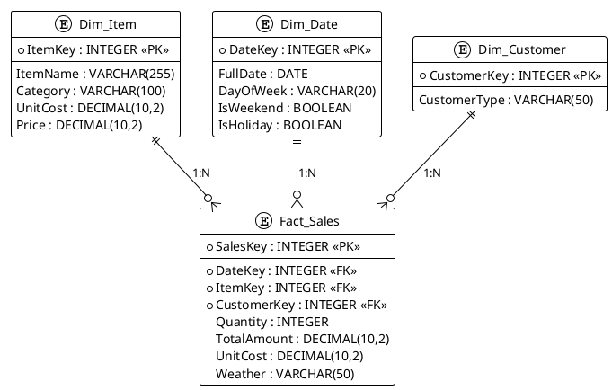

# Database Schema Diagram

This PlantUML diagram details the Entity-Relationship (ER) model of the `canteen_dw.sqlite` Data Warehouse. It uses a Star Schema design with one central Fact table and three Dimension tables.

